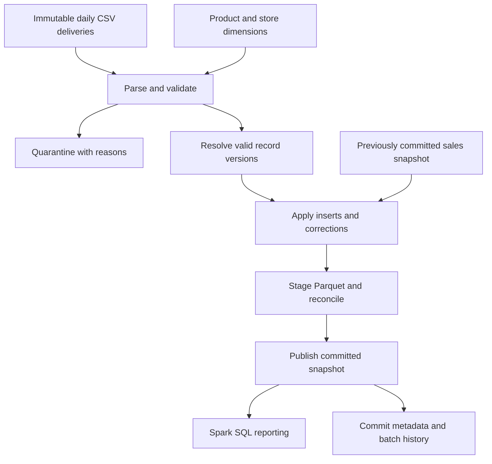

# Retail Incremental Batch ETL Pipeline

A two-day retail data engineering capstone using **Python, PySpark, and Spark SQL** to practise incremental loading, data quality, deduplication, idempotency, testing, and recovery.

**Goal:** Build one small pipeline and explain its correctness, execution, failure modes, and design tradeoffs in a technical interview.

**Status:** Learning specification. The structure, datasets, functions, and tests below are planned implementation targets; this documentation does not claim they already exist or pass. Important logic is yours to write. All project documentation stays in this README.

<a id="top"></a>

## Contents

- [Business scenario and architecture](#business-scenario-and-architecture)
- [Data contracts](#data-contracts)
- [Project structure and setup](#project-structure-and-setup)
- [Two-day plan](#two-day-plan)
- [Implementation exercises](#implementation-exercises)
- [SQL exercises](#sql-exercises)
- [Spark investigations](#spark-investigations)
- [DE review and interview checkpoints](#de-review-and-interview-checkpoints)
- [Definition of done](#definition-of-done)

## Business scenario and architecture

A retailer receives daily sales files. Deliveries contain new order lines, repeated records, corrections, invalid rows, and sales arriving after their business date. Reporting needs reliable revenue, units, order counts, and margin by date, store, and product.

Build a **daily incremental batch ETL pipeline**, running locally with static product/store dimensions and Parquet output. Incremental inputs update a small complete sales snapshot; rebuilding that snapshot is an intentional local simplification.



Log counts and outcomes throughout. Readers use the committed snapshot reference; uncommitted staging output is not reportable data. Publication and batch history must refer to the same successful result.

**Scope:** Approximately 150 sales rows across three simulated delivery dates, 10 products, and 5 stores. These deliveries are processed within two study days. No scale-up generator, cloud deployment, streaming implementation, or orchestration platform.

**Architecture boundary:** This is a warehouse-style analytical model on local files. Raw/validated/curated layers support data lake organization. Plain Parquet does not provide transactional `MERGE`; warehouse and lakehouse equivalents are design topics. A local snapshot workflow is not a distributed transaction system.

[Back to top](#top)

## Data contracts

### Datasets and grain

| Dataset | Target size / grain | Key and purpose |
| --- | --- | --- |
| `products.csv` | 10 rows; one product | `product_id`; name and category |
| `stores.csv` | 5 rows; one store | `store_id`; name and province |
| `sales_2026-04-01.csv` | About 60 source rows; one delivered order-line version | Initial load, invalid rows, duplicates |
| `sales_2026-04-02.csv` | About 50 source rows; one delivered order-line version | New lines, corrections, repeated and stale versions |
| `sales_2026-04-03.csv` | About 40 source rows; one delivered order-line version | Late arrivals, conflicts, recovery and replay |
| `dim_product`, `dim_store` | One row per product/store | Unique, non-null reference keys |
| `fact_sales` | One current accepted version per order line | Composite business key `(order_id, order_line_id)` |
| `quarantine` | One rejected source row occurrence | Source identity plus an array of rejection reasons |

Reserve at least one store with no completed sales and one product-ranking tie for SQL practice. Exact row counts and expected totals must be recorded here when the seed files are generated.

### Sales fields

| Fields | Target Spark types | Contract |
| --- | --- | --- |
| `order_id`, `store_id`, `product_id` | `StringType` | Required, trimmed, nonblank |
| `order_line_id` | `IntegerType` | Positive; unique within an order in the final fact |
| `sale_date` | `DateType` | Business date; may precede delivery date |
| `quantity` | `IntegerType` | Positive, including cancelled lines |
| `unit_price`, `unit_cost`, `discount_amount` | `DecimalType(12, 2)` | Nonnegative; discount is for the whole line |
| `order_status` | `StringType` | `COMPLETED` or `CANCELLED` |
| `updated_at` | `TimestampType` | Required source version timestamp; interpret in UTC |

Dimensions contain required strings: `product_id`, `product_name`, `category`; and `store_id`, `store_name`, `province`.

Attach `batch_id`, `run_id`, `source_file`, and a stable source-row identifier. A batch identifies a delivery; a run identifies one attempt. Source identity must survive replay and must not depend on Spark partition placement.

**Parsing:** Preserve source values so missing and malformed inputs can be diagnosed separately. Define explicit schemas and parsing rules; do not rely on inferred CSV types or assume schema declaration enforces business constraints. Structurally unreadable deliveries fail before publication.

### Business and version rules

- Require every sales field; reject invalid types, domains, ranges, missing references, and discounts exceeding `quantity × unit_price`. Dimension key defects fail the batch because they make enrichment unsafe.
- An order belongs to one store and business date. Fixtures preserve that relationship; report distinct orders using `order_id`, not order-line count.
- Completed lines: `gross_sales = quantity × unit_price`; `net_sales = gross_sales − discount_amount`; `gross_margin = net_sales − quantity × unit_cost`. Cancelled lines remain in the fact with zero realized sales, margin, and completed units. Negative margin is allowed. Choose explicit decimal result precision; avoid floating-point money.
- Separate exact duplicates from different versions. Collapse identical business payloads even when delivery metadata differs. Retain accounting for every input occurrence.
- For a business key, a newer `updated_at` supersedes an older accepted version. Equal timestamp plus equal payload is a replay. Equal timestamp plus different payload is a conflict: quarantine that conflicting incoming key group and preserve any committed version. Do not invent precedence from file order or random IDs.
- Validate before applying updates. Invalid newer records cannot erase valid committed data. Cancelled status is an update, not a physical deletion; source deletes are outside this implementation.
- Discover work by delivery/batch identity, not `sale_date > last_processed_date`. Late facts and corrections can change historical totals. Explain when a source update-time high-water mark would need overlap and deduplication.

[Back to top](#top)

## Project structure and setup

| Planned path | Responsibility |
| --- | --- |
| `README.md`, `.gitignore` | Central specification and generated-file exclusions |
| `requirements.txt` | Pin the verified local PySpark and pytest versions |
| `data/seed/` | Committed synthetic CSV dimensions and three sales deliveries |
| `src/retail_etl/__init__.py` | Package marker |
| `src/retail_etl/python_practice.py` | Local data structures, sorting, and lambda exercises |
| `src/retail_etl/schemas.py`, `ingestion.py` | Schemas, parsing, source metadata |
| `src/retail_etl/validation.py`, `transformations.py` | Quality checks, enrichment, measures |
| `src/retail_etl/incremental.py` | Version resolution and logical upserts |
| `src/retail_etl/storage.py`, `pipeline.py` | Snapshot publication, orchestration, logs and metrics |
| `sql/01_filter.sql` … `08_quality.sql` | Eight Spark SQL exercises |
| `tests/conftest.py`, `test_validation.py`, `test_transformations.py`, `test_incremental.py`, `test_pipeline.py` | Shared Spark fixture; unit and integration checks |
| `runtime/` | Generated validated data, quarantine, snapshots, staging, commit metadata, logs and metrics |
| `_scratch/` | Disposable local experiments |

Use Windows 11, VS Code, a Python virtual environment, a Java runtime compatible with the chosen PySpark release, and pytest. Reuse a working local Spark setup; record its exact versions in `requirements.txt` when scaffolding. Spark SQL runs through `spark.sql()` against temporary views, with no second database.

**Planned interface, after starter files exist:**

```powershell
python -m venv .venv
.\.venv\Scripts\Activate.ps1
python -m pip install -r requirements.txt
$env:PYTHONPATH = "$PWD\src"
python -m retail_etl.pipeline --batch-id 2026-04-01
python -m pytest -q
```

Use single-quoted Python strings, short comments explaining what/why, and transformation functions that return DataFrames. Keep reading, writing, and orchestration separate from transformation logic. Preserve seed inputs; write generated outputs under `runtime/`.

[Back to top](#top)

## Two-day plan

**16 focused hours; breaks are additional.** Keep each timebox. Record unfinished work honestly and preserve the interview practice time.

| Day | Work | Time |
| --- | --- | ---: |
| 1 | Scenario, architecture, grain, warehouse/lake/lakehouse | 45 min |
| 1 | Python structures, duplicates, sorting, lambdas, complexity | 60 min |
| 1 | Ingestion, schemas, validation, quarantine, transformations | 150 min |
| 1 | SQL exercises | 90 min |
| 1 | Initial tests, reconciliation, spoken walkthrough | 75 min |
| 1 | Rapid DE questions and weak-answer review | 60 min |
| 2 | Incremental versions, corrections, late arrivals, idempotency | 120 min |
| 2 | Failure recovery, retries, backfills, publication, observability | 75 min |
| 2 | Spark execution and performance investigations | 75 min |
| 2 | Broader DE concepts and architecture scenarios | 90 min |
| 2 | Project walkthrough and behavioral examples | 30 min |
| 2 | Mock interview | 45 min |
| 2 | Repair gaps exposed by the mock | 45 min |

**Day 1 exit:** Explain the contracts; produce a validated initial fact and quarantine; run SQL and basic correctness checks. **Day 2 exit:** Process all deliveries, demonstrate replay/recovery, inspect plans, and complete the mock.

[Back to top](#top)

## Implementation exercises

The signatures below define interfaces, not solutions. Starter files and concrete seed fixtures are a subsequent scaffold step. For each exercise, write the logic and meaningful test assertions yourself.

### 1. Python reasoning and lambdas

**Requirement / inputs → outputs:** From a list of retail record dictionaries, count occurrences of composite keys, identify duplicate keys with sets, and select the newest record per key under the conflict rule. Use parsed timestamps in local comparisons.

**Interfaces:** `count_keys(records) -> dict`; `find_duplicate_keys(records) -> set`; `select_latest(records) -> tuple[list, list]` returning winners and conflicts.

**Fixture:** Key `('O1001', 1)` appears twice identically at `09:00`, then with a correction at `10:00`; another key has different prices at the same timestamp. Add an empty list and a one-record list.

**Acceptance:** Empty input works; inputs remain unchanged; duplicates, newer versions, and conflicts are distinguished. Practise `sorted(..., key=...)`, `list.sort(key=...)`, `min`/`max` with `key=`, comprehensions, tuple keys, functions, and exceptions. Write single-field and tuple-returning lambdas yourself.

**Interview:** What does `key=` receive and return? When is `def` clearer? How do hash-based grouping and sorting differ in time/space cost? How does a Python lambda over local values differ from one building a Spark `Column` expression, or from a Python UDF?

### 2. Ingestion and data quality

**Requirement / inputs → outputs:** Raw sales plus dimensions → explicitly typed rows, validated candidates, and quarantine with all applicable reasons.

**Interfaces:** `read_batch(spark, path, batch_id) -> DataFrame`; `validate_dimensions(products_df, stores_df) -> None`; `validate_sales(sales_df, products_df, stores_df) -> tuple[DataFrame, DataFrame]`.

**Fixture:** Null key, whitespace ID, malformed quantity/date, unknown product/store, negative amount, excessive discount, and a row violating several rules. Include duplicate dimension keys.

**Acceptance:** No silent record loss; malformed and missing values are distinguishable; accepted rows satisfy rules; quarantine retains raw evidence and reasons. Check both single and composite keys. Duplicate dimensions fail before fact enrichment. Version duplicates follow the separate resolution policy.

**Interview:** Why is a declared schema insufficient? How do SQL null semantics affect rules? Why can dimension duplicates inflate revenue? How would you handle schema drift?

### 3. Initial analytical model

**Requirement / inputs → outputs:** Valid, resolved Day 1 candidates plus dimensions → unique order-line fact and date/store reporting totals.

**Interfaces:** `build_fact_sales(sales_df, products_df, stores_df) -> DataFrame`; `aggregate_daily_sales(fact_df) -> DataFrame`.

**Fixture:** Completed and cancelled sales; a multi-line order; an unsold store. One completed line has quantity `2`, price `10.00`, cost `6.00`, discount `1.00`: expected gross/net/margin are `20.00 / 19.00 / 7.00`.

**Acceptance:** Enrichment preserves fact grain; money matches hand calculations; cancelled lines contribute zero realized metrics. Compare one DataFrame result with equivalent Spark SQL. Avoid counting a multi-line order more than once.

**Interview:** Which keys are natural, composite, or surrogate? Why avoid a fresh random surrogate on every replay? Which joins/aggregations can shuffle? What changes if product attributes need history?

### 4. Incremental loading and idempotency

**Requirement / inputs → outputs:** Existing fact plus a new validated delivery → updated fact and per-row outcome counts.

**Interfaces:** `resolve_versions(incoming_df, current_df) -> tuple[DataFrame, DataFrame, DataFrame]` returning candidates, conflicts, and ignored occurrences; `apply_upserts(current_df, candidates_df) -> DataFrame`.

**Fixture:** New key, newer correction, stale correction, exact replay, equal-time conflict, and an April 1 sale delivered April 3. Reuse the same fixtures for initial loading with an empty current fact.

**Acceptance:** One fact row per key; newer corrections replace values; stale/repeated rows do not change state; conflicts preserve committed data. Replaying any delivery yields the same business snapshot and totals. Batch IDs identify immutable contents; changed contents under an existing ID must fail. Verify that a late arrival changes its historical reporting date.

**Interview:** Why is append insufficient? How is deduplication different from idempotency? What are insert/update/no-op conditions in a warehouse `MERGE`? Why can an event-date watermark miss data?

### 5. Publication, recovery, and observability

**Requirement / inputs → outputs:** A reconciled candidate snapshot → a committed version, recoverable batch history, and structured run metrics.

**Interfaces:** `publish_snapshot(fact_df, batch_id, run_id, output_root) -> dict`; `run_batch(batch_id, fail_at=None) -> dict`.

**Fixture:** Inject failure after staging but before publication, then after publication but before success logging. Retry the same delivery; backfill an older delivery.

**Acceptance:** Readers continue using the previous committed result when staging fails. Never overwrite the snapshot being lazily read. Batch completion advances only with a successful commit; restart can derive completion from committed metadata even if final logging failed. Document the local publication mechanism and its filesystem assumptions here; do not claim distributed atomicity or concurrent-writer safety.

**Metrics:** `batch_id`, `run_id`, status, duration, source rows, validation rejects, version conflicts, ignored occurrences, inserts, updates, final rows, net sales, committed version, source update maximum, delivery delay, and last successful commit time. Distinguish event freshness from pipeline freshness; a late sale is not itself a processing failure.

**Interview:** Where is the commit boundary? Which failures are retryable? How do you avoid advancing state too soon? How would transactional tables change recovery and concurrent writes?

### 6. Tests and reconciliation

**Requirement / inputs → outputs:** Small deterministic fixtures and batch results → passing assertions or actionable failures. Use a reusable session-scoped Spark fixture and isolated temporary output directories.

**Interface:** `reconcile(before_df, after_df, outcomes) -> dict`; tests follow `test_<behavior>(spark, tmp_path)` where needed.

**Acceptance:** Cover schema, multiple rejection reasons, duplicate keys, RI, decimal measures, version precedence, equal-time conflict, late arrivals, replay, and failure/retry. Compare DataFrames without relying on row order; preserve multiplicities and compare schemas. Include an end-to-end three-delivery test.

Use mutually exclusive outcomes for row accounting:

`source occurrences = validation rejects + version-conflict rejects + ignored occurrences + inserts + updates`

`final fact rows = prior fact rows + inserts` (this project has no physical deletes).

`final net sales = prior net sales + inserted net sales + sum(new − old net sales for updates)`.

Ignored occurrences include duplicate copies, superseded versions, and stale/repeated candidates. A row with several rejection reasons counts once. Logs may gain attempts on replay; business state must remain stable.

**Interview:** Why is a row-count check insufficient? What distinguishes unit and integration tests? How can a set comparison hide duplicates? Which assertion would catch a many-to-many join?

[Back to top](#top)

## SQL exercises

Register `fact_sales`, `dim_product`, `dim_store`, `incoming_sales`, and `current_sales` as temporary views. Version-analysis views contain typed source fields. Use Spark SQL; warehouse `MERGE` remains conceptual. Each numbered row is one query-file exercise and may contain short subqueries/tasks.

| # | Requirement and input | Expected output / grain | Acceptance and interview check |
| --- | --- | --- | --- |
| 1 | Filter `fact_sales` by date/status; practise `CASE`, `COALESCE`, `IS NULL` | Order key, date, status, net sales; one selected line | Explicit date boundaries. When does replacing null with zero hide bad data? |
| 2 | Left join stores to completed sales; also explain an inner join | Store ID, revenue, completed-line count; one row per store | Include all 5 stores, with zero for unsold stores. Why do `WHERE` vs `ON` and `COUNT(*)` vs `COUNT(column)` matter? |
| 3 | Conditional aggregation over facts; practise `GROUP BY` and `HAVING` | Date/store, revenue, units, distinct orders, cancelled-line count | Reconcile totals; distinguish line/order counts. How does `HAVING` differ from `WHERE`? |
| 4 | CTEs and pre-aggregation for average completed order value | Store ID, completed-order count, average order value | Multi-line orders count once; cancelled lines add no revenue. Why is average line value wrong? |
| 5 | Aggregate products within category, then rank | Category, product ID, revenue, `ROW_NUMBER`, `RANK`, `DENSE_RANK` | Revenue ties remain ties for rank functions; row-number selection has deterministic ordering. Which ranking fits “top 2 including ties”? |
| 6 | Daily store totals with `LAG` and cumulative revenue | Date/store, revenue, prior observed-date revenue, change, cumulative revenue | Explicit cumulative window frame; no invented missing dates. Is the prior observed date necessarily yesterday? |
| 7 | Analyse valid incoming/current versions with CTEs and windows | Business key, candidate timestamp, outcome | Match the incremental conflict/precedence policy; classify inserts, updates, repeats, stale versions, and conflicts. Why is `DISTINCT` insufficient? |
| 8 | Quality and reconciliation queries over facts/dimensions | Violating keys/references; summary counts and totals | Detect duplicate composite keys and orphans; reproduce reconciliation. How does pre-aggregation prevent join fan-out? |

[Back to top](#top)

## Spark investigations

Use the small data, `explain('formatted')`, and the local Spark UI. Record observed plans and metrics in this README during implementation. Timing differences on these inputs are not evidence of production speedups.

| Investigation | Evidence to collect | Explain |
| --- | --- | --- |
| Execution anatomy | Follow an action through SQL, Jobs, Stages, and task counts | Lazy evaluation; driver/executors; narrow/wide operations; shuffle boundaries. One action can involve multiple jobs. |
| Join strategy | Compare broadcast and sort-merge plans under deliberate experiment settings; confirm actual operators | Broadcast exchange vs key shuffles; join cardinality; broadcast memory limits; restore settings afterward |
| Parquet reads | Inspect read schema, pushed filters, and partition filters on unpartitioned and date-partitioned experiment outputs | Column pruning vs predicate pushdown vs partition pruning; partitioning and small-file costs |
| Partition changes | Inspect `repartition` and `coalesce`, Exchange nodes, and output files | Storage/input/execution/shuffle/output partitions; balancing versus reducing parallelism |
| AQE, skew, memory | Compare initial/final adaptive plans when visible; interpret hypothetical task and shuffle metrics | AQE coalescing/skew handling; hot keys vs non-skew stragglers; spill/GC; caching only justified reuse |

Keep the core fact snapshot unpartitioned for this tiny dataset. Use a separate disposable output for the partition-pruning experiment. Discuss scale and skew without generating larger data or claiming effects the experiment did not show.

[Back to top](#top)

## DE review and interview checkpoints

**After every major implementation, answer aloud:** Why this approach and what alternative? What is the input/output grain? What triggers Spark work and shuffles? What proves correctness? What happens on failure or replay? Is it idempotent? What breaks at 100× volume? What tradeoff follows?

| Area | Questions to practise |
| --- | --- |
| Architecture | ETL vs ELT? Batch vs streaming? What volume, latency, consumers, update patterns, and recovery objectives must you clarify first? |
| Modeling and storage | OLTP vs OLAP? Normalization vs star schema? Natural/composite/surrogate keys? Lake vs warehouse vs lakehouse? SCD Type 1 vs Type 2 and historical fact joins? |
| Ingestion | Files vs APIs vs database extracts? What does CDC capture? How do contracts, schema drift, event time, arrival time, and source update time differ? |
| Reliability | Transactions and atomicity? At-least-once delivery with idempotent outcomes? Checkpoints vs batch history? Replay vs retry vs backfill? What evidence supports an exactly-once claim? |
| Operations | Scheduling and dependencies? Unit/integration checks before deployment? Configuration and secrets? Freshness, reconciliation, lineage, least privilege, sensitive data, and cost controls? |
| Scaling | Large snapshots, small files, skew, executor memory, broadcast limits, and shuffle costs? What would you change before moving to a warehouse or transactional table format? |
| Communication | Give a two-minute pipeline walkthrough. Explain a bug, evidence used, fix, and tradeoff. Prepare truthful examples of ambiguity, learning, debugging, and collaboration. |

Warehouse modeling and analytical queries are implemented locally. SCDs, warehouse `MERGE`, and transactional lakehouse capabilities—atomic commits, consistent reads, concurrency control, schema evolution, and history—remain conceptual. Keep CDC, orchestration, security, and deployment review at interview depth.

**Assistance ladder:** Conceptual hint → relevant API → pseudocode → partial code → complete solution only on explicit request.

### Final 45-minute mock interview

| Segment | Time | Task |
| --- | ---: | --- |
| Python | 7 min | Solve a small record/dictionary problem; explain a lambda and complexity |
| SQL | 8 min | Write a join/window query and defend grain/cardinality |
| PySpark | 10 min | Explain a plan, shuffle, join choice, and performance diagnosis |
| Architecture and capstone | 12 min | Design incremental loading; handle late data, replay, and partial failure |
| Behavioral/project reasoning | 8 min | Explain decisions, debugging evidence, learning, and collaboration |

Score correctness, clarity, evidence, and tradeoff awareness. Use the final 45-minute repair block on the weakest answers.

[Back to top](#top)

## Definition of done

- [ ] Seed contracts and exact expected counts/totals are recorded here.
- [ ] Three deliveries produce a unique, typed, reconciled sales fact and traceable quarantine.
- [ ] Corrections, stale versions, conflicts, cancellations, and late arrivals follow the stated rules.
- [ ] Replay preserves business state; controlled failures recover without publishing partial results.
- [ ] Meaningful unit/integration tests and eight SQL exercises are complete.
- [ ] Spark plan observations distinguish measured evidence from scale-related reasoning.
- [ ] Implemented behavior, local limitations, and conceptual extensions are described honestly.
- [ ] A two-minute walkthrough and 45-minute mock interview are complete; weak areas are reviewed.

[Back to top](#top)
